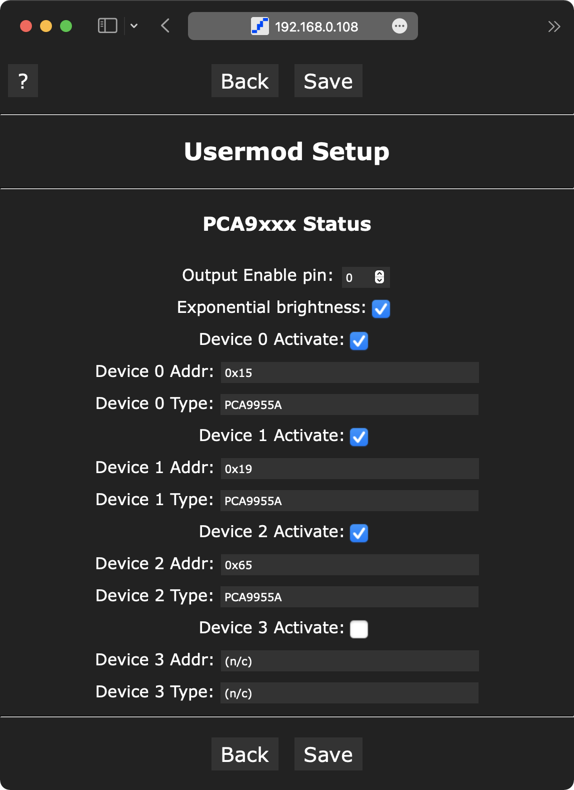

# WLED-PCA9xxx
Private userMod for [WLED](https://github.com/Aircoookie/WLED.git)

It's a usermod of [WLED](https://github.com/Aircoookie/WLED.git) using [PCA9xxxPWM](https://github.com/kchinzei/PCA9xxxPWM.git) library.
PCA9xxx is an I2C based PWM controller chips from NXP.

At this moment I don't have a plan to ask a pull request, because it's [PCA9xxxPWM](https://github.com/kchinzei/PCA9xxxPWM.git) library specific  and not testable for many others.

## Build it

Basically, this repository keeps its own files apart from [WLED](https://github.com/Aircoookie/WLED.git) files.
This makes following updates in [WLED](https://github.com/Aircoookie/WLED.git) easy.
But you need to place the files into proper places before building [WLED](https://github.com/Aircoookie/WLED.git).

- Copy `platformio_override.ini` to `WLED`.
- Copy `usermods_list.cpp` to `WLED/wled00` (overwrite existing one).
- Copy `extLibs` to `WLED/wled00`.

In Linux or macOS you can also use `ln` terminal command so that any changes to these files inside `WLED` folder will be visible by git commands.

## The UserMod

This usermod add a functionality to control PWM value of PCA9xxx devices. It is tested on ESP-WROOM-2 (d_mini) and ESP32-WROOM-32 (esp32).

### Current implementation

- Hot plug in/out.
- Device-wise activation on/off.
- I2C address and device type (display only).
- PWM value follows the main brightness slider.
- All PWM channels use the same value.
- I2C pins (SDA/SDL) fixed to the default of the hardware. [Pins 4 and 5 for esp8266](https://arduino-esp8266.readthedocs.io/en/latest/libraries.html#i2c-wire-library), [pins 21 and 22 for the generic ESP32 but can vary from board to board](https://docs.espressif.com/projects/arduino-esp32/en/latest/api/i2c.html).
- Exponential PWM value (not uniform across PCA9955A and other devices.)

### Future implementation

- Channel-wise control of the PWM value.
- Smooth change of PWM value.
- Customizable I2C pins.
- Exponential PWM value uniform across devices.

## License

MIT License

Copyright (c) 2022 Kiyo Chinzei (kchinzei@gmail.com)

Permission is hereby granted, free of charge, to any person obtaining a copy
of this software and associated documentation files (the "Software"), to deal
in the Software without restriction, including without limitation the rights
to use, copy, modify, merge, publish, distribute, sublicense, and/or sell
copies of the Software, and to permit persons to whom the Software is
furnished to do so, subject to the following conditions:

The above copyright notice and this permission notice shall be included in all
copies or substantial portions of the Software.

THE SOFTWARE IS PROVIDED "AS IS", WITHOUT WARRANTY OF ANY KIND, EXPRESS OR
IMPLIED, INCLUDING BUT NOT LIMITED TO THE WARRANTIES OF MERCHANTABILITY,
FITNESS FOR A PARTICULAR PURPOSE AND NONINFRINGEMENT. IN NO EVENT SHALL THE
AUTHORS OR COPYRIGHT HOLDERS BE LIABLE FOR ANY CLAIM, DAMAGES OR OTHER
LIABILITY, WHETHER IN AN ACTION OF CONTRACT, TORT OR OTHERWISE, ARISING FROM,
OUT OF OR IN CONNECTION WITH THE SOFTWARE OR THE USE OR OTHER DEALINGS IN THE
SOFTWARE.
